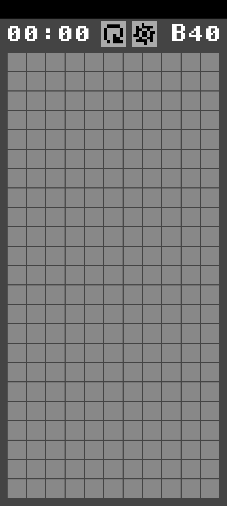
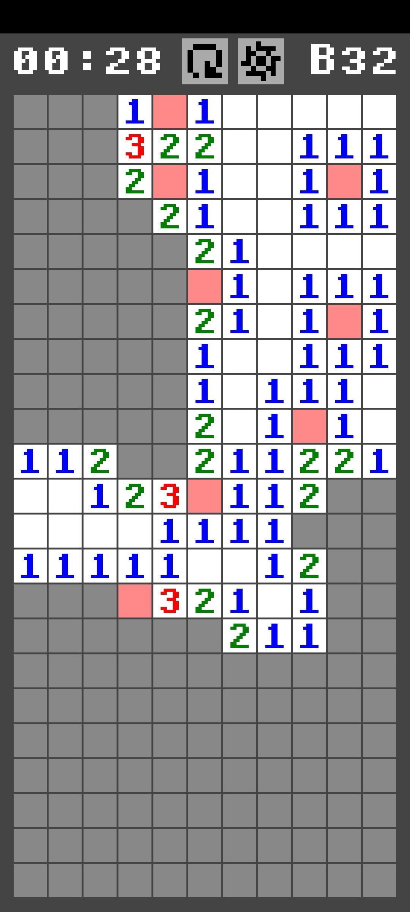
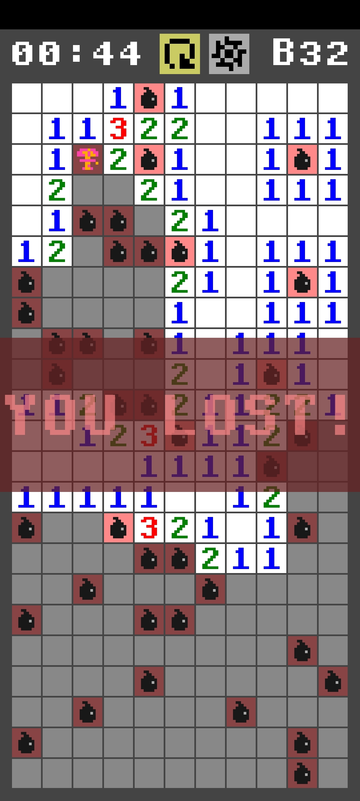
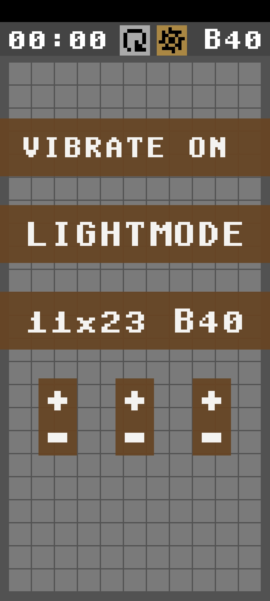

# Kaysweeper

This is a minesweeper clone for Android written in C using [rawdrawandroid](https://github.com/cnlohr/rawdrawandroid).
With custom Pixelart by me and a font partially from [Romano Mancini](https://github.com/Romano-Mancini/ASCIISymbols8x8Display).

<p align="center">
  
  
</p>

<p align="center">
  
  
</p>

## Features

- light/dark theme
- preconfigured and custom boards
- persistence of a game

## Building

- install prerequisites of rawdrawandroid
- clone this repo
- ```git submodule update --init --recursive```
- ```make all``` or use adb to install directly ```make all push```/```make all run```
